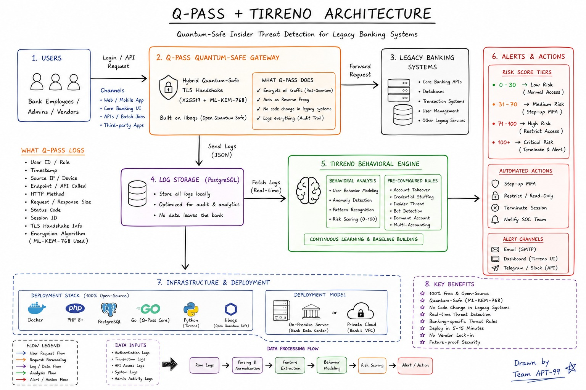

# Q-PASS + Sentrion: Quantum-Safe Insider Threat Detection for Legacy Banking

## Problem Statement
Legacy banking systems are exposed to insider threats, privileged access
misuse, and credential-based attacks — while also facing a looming risk from
quantum computing, which threatens the classical cryptography protecting
data in transit today ("harvest now, decrypt later" attacks). This project
addresses both: real-time behavioral threat detection, delivered over a
quantum-safe transport layer, with zero code changes required to the legacy
systems being protected.

## What We Built
- **Q-PASS** — a quantum-safe reverse proxy gateway (Go), using a hybrid
  X25519 + ML-KEM-768 TLS key exchange, sitting transparently in front of
  legacy banking systems. Logs a full audit trail of every request and
  forwards behavioral events for analysis.
- **Sentrion** — a behavioral analysis and risk-scoring engine, built on the
  open-source [tirreno](https://github.com/tirrenotechnologies/tirreno)
  project (see Attribution), detecting insider threats, account takeover,
  and credential stuffing via a rule engine and continuous baselining.

## Architecture


## Quantum-Safe Verification
Verified using OpenSSL 3.5 against the live Q-PASS gateway:
$ openssl s_client -groups X25519MLKEM768 -connect localhost:8443 -brief
Negotiated TLS1.3 group: X25519MLKEM768
Classical clients (curl, standard browsers) fall back gracefully to X25519,
preserving compatibility with existing systems during migration.

## Simulation Results
See [docs/SIMULATION-RESULTS.md](docs/SIMULATION-RESULTS.md) for full
scenario walkthroughs and observed risk scores (normal behavior,
credential stuffing, account takeover, off-hours access).

## Real-World Deployment Path
- Identity extraction from the bank's real auth system (session/JWT/SSO)
  replacing the test `X-User-Id` header
- Redundant Q-PASS instances behind a load balancer for high availability
- Message queue (Kafka/RabbitMQ) between Q-PASS and Sentrion at scale
- Managed secrets (Vault/AWS Secrets Manager) instead of local `.env`
- Log-shipper adapters for non-HTTP sources (DB audit logs, SSH/admin
  activity, mainframe batch jobs)

## Setup / Run Instructions
```bash
git clone https://github.com/AnshrajDodiya/qpass-sentrion.git
cd qpass-sentrion
cd qpass && ./gen-certs.sh && cd ..
echo "SENTRION_API_KEY=your-key-here" > .env
docker compose up -d --build
```
Visit `http://localhost:8585/install/index.php` to complete Sentrion setup,
then `https://localhost:8443` for the Q-PASS-fronted service.

## Attribution
Sentrion's event-tracking and rule-engine core is built on
[tirreno](https://github.com/tirrenotechnologies/tirreno), an open-source
(AGPL-3.0) security framework, rebranded for this project. Our original
contribution is the Q-PASS quantum-safe gateway, its integration with the
tirreno-based engine, and the insider-threat use case built around it.

## License
AGPL-3.0 — inherited from the upstream tirreno project. See [LICENSE](LICENSE).

## Team
Team APT-99
